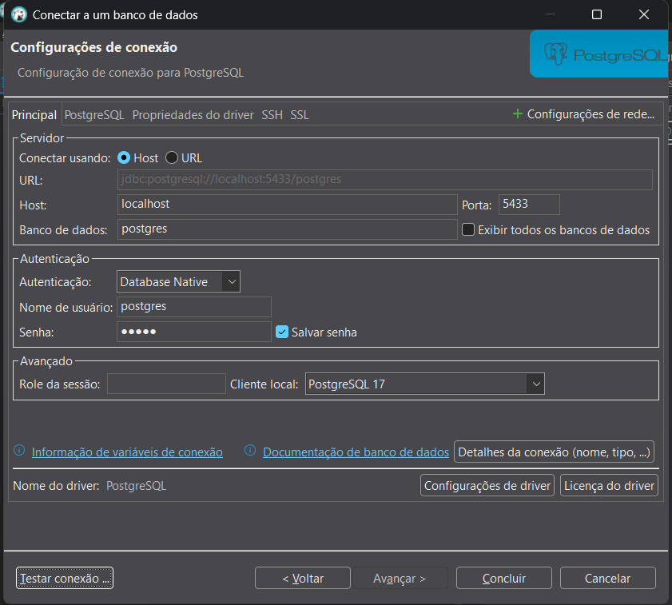

# Desafio_Tecnico

OBS: Para que o projeto rode normalmente, você deve garantir o acesso das portas 8000, 5000 e 5433 em sua máquina. Ou seja, não tenha outro software ocupando uma dessas portas e/ou alguma aplicação privando o acesso de alguma delas.

1º Efetue o download do .zip do projeto
2º Inicie o Docker na sua máquina
3º Abra o projeto descompactado no seu editor de códigos
4º Abra o prompt de comandos
5º Garanta que esteja dentro da pasta do projeto
6º Escreva o seguinte comando:

docker-compose up --build

Ele criará a imagem do projeto e iniciára os containers necessitados pelo projeto.

7º Abra o navegador e acesse o "site"

http://localhost:8000

Você acesará a página principal do projeto

Más, caso queira acessar a api, acesse:

http://localhost:5000

Para acessar o banco de dados usando alguma aplicação específica...:
Exemplo usando o DBeaver:

Senha: titan

